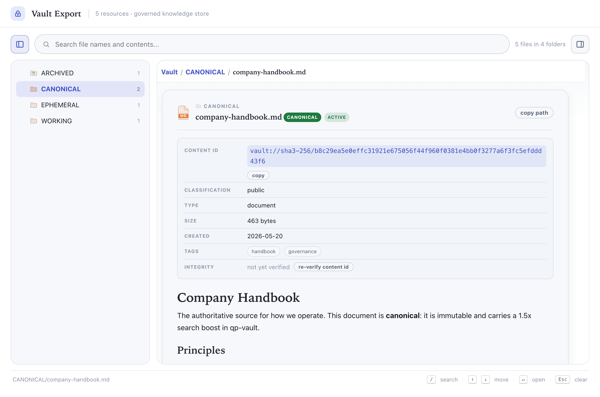

# QP Vault web explorer

A single-file, no-build, air-gap-safe web UI for browsing a vault. Open it in any browser
and you get a folder tree, an inline markdown reader, full-text search, semantic folder
and document-file icons, a type filter, a document outline, and full keyboard navigation.
No server, no framework, no external requests.

Point it at a directory on disk, **or** at a `vault.export_vault()` JSON to get a
governance view: trust-tier pills, lifecycle, content ids, supersession chains, and
**in-browser SHA3-256 re-verification** of every resource.



## Quick start

```sh
# 1. point the generator at the directory you want to browse
python generate_manifest.py /path/to/your/vault --title "My Vault"

# 2. open the explorer (it reads the manifest.js you just wrote)
open index.html          # macOS
# or: xdg-open index.html (Linux), or double-click it
```

That writes `manifest.js` next to `index.html`. Reload the page after regenerating.

Browse this repository itself:

```sh
python generate_manifest.py ../.. --title "QP Vault" --subtitle "Reference explorer"
open index.html
```

## How it works

The explorer is `index.html`. It is fully static and renders whatever four globals the
manifest defines:

| Global | Shape | Purpose |
|---|---|---|
| `window.VAULT_BASE` | string | base URL for "open in tab" and image resolution |
| `window.VAULT_FILES` | `string[]` | relative file paths; the folder tree is derived from these |
| `window.VAULT_META` | `{ [path]: { m: "YYYY-MM-DD" } }` | modified date, drives "Recently updated" and sort |
| `window.VAULT_CONTENT` | `{ [path]: string }` | inlined text for the reader and full-text search |

Optional globals tune the chrome and governance display:

| Global | Shape | Purpose |
|---|---|---|
| `window.VAULT_TITLE` / `VAULT_SUBTITLE` | string | header title and subtitle |
| `window.VAULT_DESC` | string | description line shown above the root file list |
| `window.VAULT_FOLDER_DESC` | `{ [folder]: string }` | one-line description per top-level folder |
| `window.VAULT_TIERS` | `{ [folder]: [label, cssClass] }` | governance tier pill on a folder, e.g. `["Canonical","canonical"]` (classes: `canonical`, `working`, `ephemeral`) |

`generate_manifest.py` is just the simplest producer of that contract.

## Governance mode (qp-vault export)

Pass a `vault.export_vault()` JSON instead of a directory and the explorer becomes a
governance view of the actual store:

```sh
# in Python: vault.export_vault("vault.json")
python generate_manifest.py --from-export vault.json --title "My Vault"
open index.html
```

Resources are grouped under a top-level **trust-tier** folder (CANONICAL / WORKING /
EPHEMERAL / ARCHIVED). The export adds these globals:

| Global | Shape | Purpose |
|--------|-------|---------|
| `window.VAULT_GOV` | `{ [path]: { tier, lifecycle, cls, type, cid, hash, merkle, size, created, updated, supersedes, superseded_by, tags, id, name } }` | per-resource governance metadata |
| `window.VAULT_CHUNKS` | `{ [path]: [ { c: content, h: cid } ] }` | chunk content + content ids; drives the reader, search, and verification |
| `window.VAULT_IDPATH` | `{ [resource_id]: path }` | resolves supersession links to a path |

In governance mode the explorer shows a **trust-tier pill** on every resource, a
**lifecycle** badge, the **content id** (SHA3-256), classification, size, tags, and
clickable **supersedes / superseded-by** links. Search results are **trust-weighted**
(CANONICAL 1.5x, WORKING 1.0x, EPHEMERAL 0.7x, ARCHIVED 0.5x).

### In-browser verification

Web Crypto does not implement SHA3, so `sha3.js` (a small, dependency-free FIPS 202
implementation, verified against Python `hashlib`) ships alongside the explorer. Click
**re-verify content id** on any resource and the browser re-hashes each chunk
(`vault://sha3-256/<sha3(content)>`) and the resource digest (`sha3(concat(sorted(cids)))`,
matching `resource_manager.compute_resource_hash`) and reports **verified** or
**tampered**. This happens entirely offline, with no trust in the server that produced
the manifest. It is the explorer's reason to exist: *knowledge that can't be verified
can't be trusted.*

## Generator options

```
python generate_manifest.py [root] [options]

  root                 directory to index (default: .)
  -o, --output FILE    output file (default: manifest.js)
  --title TEXT         header title
  --subtitle TEXT      header subtitle
  --desc TEXT          root description line
  --base URL           base URL for opening files
                       (default: file:// of the indexed dir; use '' for relative when served over http)
  --max-bytes N        per-file content cap (default: 524288)
  --no-content         index names + tree only; skip contents (smaller, no full-text search)
  --ignore NAME        extra directory name to skip (repeatable)
  --all                include hidden (dotfile) entries
```

Text files (markdown, code, config, csv, and similar) are inlined for the reader and
search. Binaries are listed in the tree and open in a new tab. The generator depends only
on the Python standard library.

## Theming

The look is driven entirely by CSS custom properties in the `:root` block at the top of
`index.html`. Change those tokens to reskin; nothing else is hardcoded. The default is a
neutral light theme with an indigo accent. File-type colors (the document-icon bands) and
folder-category tints are intentionally fixed so file types stay recognizable across
themes, the same way a desktop file manager keeps type colors stable.

Fonts are system fonts only, so there are no external requests. If you want the display
serif used in the source vault, drop a `Fraunces` face into the page locally; the
`--display` token already lists it first.

## Folder iconography

Folders get a category icon and tint inferred from their name (`docs`, `src`, `tests`,
`config`, `assets`, `data`, plus knowledge-vault categories like `governance`, `research`,
`risk`, `archive`, and more). Unrecognized names get a clean default folder. Document
icons are colored and labeled by file type (MD, PDF, JSON, and so on).

## Air-gap and privacy

The explorer makes zero network requests: no fonts CDN, no analytics, no framework from a
package host. Everything renders from the local manifest. It is safe to open on an
air-gapped machine. `manifest.js` embeds file contents in plain text, so treat a generated
manifest with the same care as the directory it indexes, and do not commit one that points
at private paths (this folder's `.gitignore` excludes `manifest.js` for that reason).

## Files

```
examples/web-explorer/
  index.html            the explorer (self-contained: HTML + CSS + JS)
  sha3.js               dependency-free SHA3-256 for in-browser verification
  generate_manifest.py  stdlib-only manifest generator (directory scan + export adapter)
  manifest.sample.js    committed governance demo (loads on first open)
  sample-export.json    the export the demo is built from
  manifest.js           generated, git-ignored (run the generator to create it; overrides the demo)
  screenshot.png        the image used in this README
  tests/                contract tests (python) + sha3/verification tests (node)
  README.md             this file
```

## Tests

```sh
python tests/test_generate_manifest.py    # manifest contract: on-disk + export modes
node --test tests/test_sha3.mjs           # SHA3-256 vectors + verify accepts/rejects
```

Both run in CI (`.github/workflows/python-ci.yaml`, the `web-explorer` job). The contract
test extracts nothing from a stale copy: it runs the real generator and asserts the
emitted `window.VAULT_*` shape, so the generator can never drift from `index.html`.
